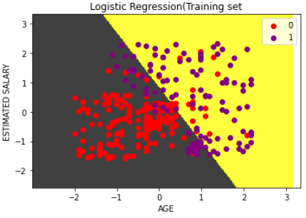

# Implementation-of-Logistic-Regression-Using-Gradient-Descent

## AIM:
To write a program to implement the the Logistic Regression Using Gradient Descent.

## Equipments Required:
1. Hardware – PCs
2. Anaconda – Python 3.7 Installation / Moodle-Code Runner

## Algorithm
1. Import pandas to read the csv File.
2. Import numpy to develop the mesh grid for the Dataset.
3. Import train_test_split from sklearn.model_selection to split the given data.
4. Import StandardScaler from sklearn.preprocessing to pre-process the sample data.
5. Import confusion_matrix from sklearn_metrics to find the performance over a time.
6. Import metrics from the sklearn to find the accuracy of the Dataset.
7. Import LogisticRegression from sklearn.linear_model
8. Import matplotli.pyplot to visualize the samples.
9. Import ListedColormap from matplotlib.colors to customize the representation.
10. Display the graph.


## Program:
```
Program to implement the the Logistic Regression Using Gradient Descent.
Developed by: Naveen kumar.S
Register No: 212221240033

import numpy as np
import matplotlib.pyplot as plt
import pandas as pd

datasets=pd.read_csv("Social_Network_Ads (1).csv")
x=datasets.iloc[:,[2,3]].values
y=datasets.iloc[:, 4].values

from sklearn.model_selection import train_test_split
X_train,X_test,Y_train,Y_test = train_test_split(x,y,test_size = 0.25,random_state = 0)

from sklearn.preprocessing import StandardScaler
sc_X=StandardScaler()

from sklearn.linear_model import LogisticRegression
X_train=sc_X.fit_transform(X_train)
X_test=sc_X.transform(X_test)

from sklearn.linear_model import LogisticRegression
classifier=LogisticRegression(random_state=0)
classifier.fit(X_train,Y_train)
Y_pred=classifier.predict(X_test)

from sklearn.metrics import confusion_matrix
cm=confusion_matrix(Y_test,Y_pred)

from sklearn import metrics
accuracy=metrics.accuracy_score(Y_test,Y_pred)
recall_sensitivity=metrics.recall_score(Y_test,Y_pred,pos_label=1)
recall_sensiticity=metrics.recall_score(Y_test,Y_pred,pos_label=0)
recall_sensitivity,recall_sensiticity

from matplotlib.colors import ListedColormap
X_set,Y_set=X_train,Y_train
X1,X2=np.meshgrid(np.arange(start=X_set[:,0].min()-1,stop=X_set[:,0].max()+1,step=0.01),np.arange(start=X_set[:,1].min()-1,stop=X_set[:,1].max()+1,step=0.01))
plt.contourf(X1,X2,classifier.predict(np.array([X1.ravel(),X2.ravel()]).T).reshape(X1.shape),alpha=0.75,cmap=ListedColormap(("black","yellow")))
plt.xlim(X1.min(),X2.max())
plt.ylim(X2.min(),X2.max())
for i,j in enumerate(np.unique(Y_set)):
  plt.scatter(X_set[Y_set==j,0],X_set[Y_set==j,1],c=ListedColormap(("red","purple"))(i),label=j)
plt.title("Logistic Regression(Training set")
plt.xlabel("AGE")
plt.ylabel("ESTIMATED SALARY")
plt.legend()
plt.show()

*/
```

## Output:



## Result:
Thus the program to implement the the Logistic Regression Using Gradient Descent is written and verified using python programming.

